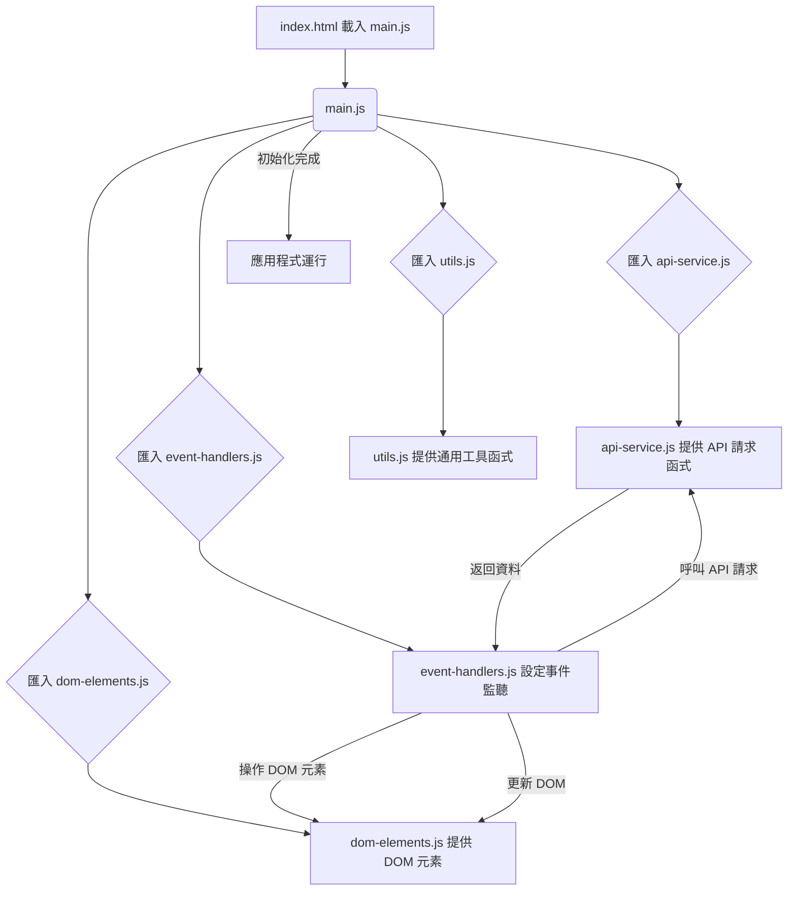
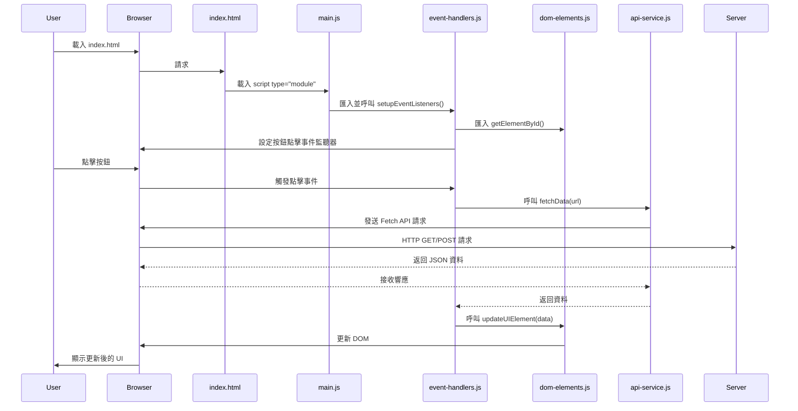

# 專案規格文件：JavaScript 模組化規劃

## 1. 專案描述

本文件旨在規劃 `static/script.js` 檔案的模組化策略。隨著專案的發展，`script.js` 檔案的行數不斷增加，導致程式碼難以維護、理解和擴展。本規劃將透過模組化，提升程式碼品質和開發效率。

## 2. 模組化目標

*   **提高程式碼可讀性與可維護性**：將大型檔案拆分為更小、更專注的模組。
*   **增強程式碼重用性**：建立獨立的功能模組，方便在不同部分重複使用。
*   **降低耦合度**：減少模組間的直接依賴，使修改一個模組不易影響其他模組。
*   **促進團隊協作**：不同開發者可以同時處理不同的模組，減少衝突。
*   **為未來擴展奠定基礎**：清晰的模組結構有助於未來引入前端框架或建構工具。

## 3. 建議的檔案結構

為了有效地組織 JavaScript 模組，建議在 `static/` 目錄下創建一個新的 `js/` 目錄，並將所有 JavaScript 模組放置於此。

```
static/
├── index.html
├── style.css
└── js/
    ├── main.js             // 應用程式主入口，負責協調和初始化
    ├── dom-elements.js     // 負責 DOM 元素的選取和管理
    ├── event-handlers.js   // 負責事件監聽和處理
    ├── api-service.js      // 負責與後端 API 互動
    ├── utils.js            // 存放通用工具函式
    └── components/         // 可選：存放可重用的 UI 組件
        ├── componentA.js
        └── componentB.js
```

### 模組職責說明：

*   **`main.js`**:
    *   **職責**：應用程式的啟動點。匯入其他模組，並協調它們的初始化和互動。
    *   **內容**：應用程式的整體流程控制、初始化函式呼叫。
*   **`dom-elements.js`**:
    *   **職責**：集中管理所有需要操作的 DOM 元素。
    *   **內容**：提供函式來選取特定的 HTML 元素，並將其匯出供其他模組使用。
*   **`event-handlers.js`**:
    *   **職責**：定義和設定所有使用者介面事件的監聽器及其處理邏輯。
    *   **內容**：包含 `addEventListener` 呼叫和事件回調函式。
*   **`api-service.js`**:
    *   **職責**：封裝所有與後端 API 互動的邏輯。
    *   **內容**：包含 `fetch` 或 `XMLHttpRequest` 請求，處理請求和響應。
*   **`utils.js`**:
    *   **職責**：存放專案中通用的輔助函式。
    *   **內容**：例如日期格式化、字串處理、資料驗證、數學運算等。
*   **`components/`**:
    *   **職責**：存放可重用的 UI 組件的 JavaScript 邏輯。
    *   **內容**：每個檔案代表一個獨立的 UI 組件，包含其自身的 DOM 操作和事件處理。

## 4. 模組互動流程圖 (Flowchart)

以下流程圖展示了應用程式啟動時，`main.js` 如何協調其他模組的初始化和互動。



## 5. 模組間循序圖 (Sequence Diagram)

以下循序圖展示了一個典型的使用者互動流程：使用者點擊按鈕，觸發 API 請求，然後更新 UI。



## 6. 物件關聯圖 (Class Diagram)

由於目前是原生 JavaScript 模組化，且未引入類別概念，此處提供一個概念性的物件關聯圖，展示模組間的邏輯關係。未來若引入類別或更複雜的資料結構，此圖可進一步細化。

```mermaid
classDiagram
    direction LR
    class Main {
        +initApp()
    }
    class DOM_Elements {
        +getElementById(id)
        +querySelector(selector)
        +updateElementText(element, text)
    }
    class Event_Handlers {
        +setupEventListeners()
        +handleClickEvent()
    }
    class API_Service {
        +fetchData(url, options)
        +postData(url, data)
    }
    class Utils {
        +formatDate(date)
        +isValidEmail(email)
    }

    Main --|> Event_Handlers : 協調
    Main --|> DOM_Elements : 協調
    Main --|> API_Service : 協調
    Main --|> Utils : 協調

    Event_Handlers ..> DOM_Elements : 使用
    Event_Handlers ..> API_Service : 使用
    API_Service ..> Utils : 使用